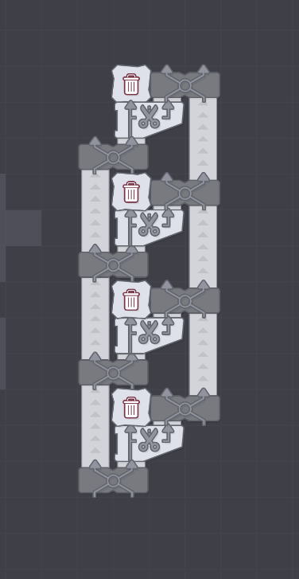
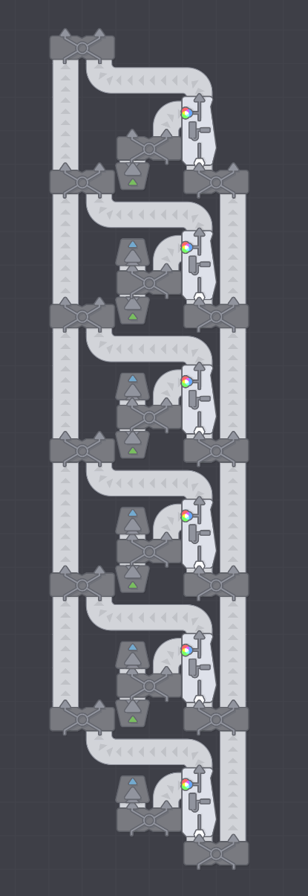
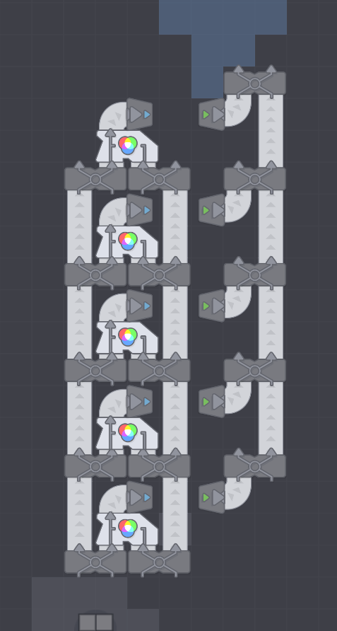
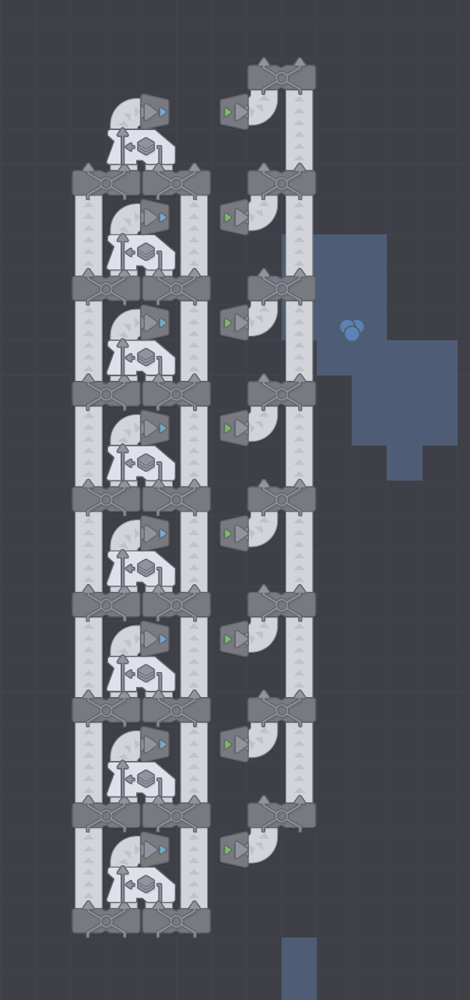

## Steps

### Basic shapes
- feed four lines of circles
- feed four lines of squares
- create cutting lines x2

### Cutting

- merge lines of circles into cutting line
- after done
- feed first cutting line into second cutting line

- create 4x painting lines

### Painting

- feed circles into painting line
- feed red into painting line
- feed squares into cutting line then painting
- feed blue into painting line

- create 3x mixing lines

### Mixing
- feed red + blue into mixing line
- feed purple into painting line
- feed blue + green into mixing line
- feed light blue into painting line
- feed stars into painting line

- create stacking lines 2x

### Stacking
- feed green into painting
- feed circles into painting
- feed circles into cutting
- feed stars into cutting
- feed halves into stacking

- feed blue into painting line
- feed lipped shape into painting line
- feed purple + green into mixing
- feed white into painting
- feed circles into painting
- feed circles + lipped shape into stacking

stacking
cutting
painting
mixing

lvl3 + 4
cutting x2

lvl 6
cutting x2

lvl 7+8
painting x2

lvl 9 + 10
mixing x2

lvl 11
mixing
painting x2
cutting x2
stacking

lvl 12
mixing
painting x2
stacking

final
cutting x2
mixing x2
paiting x4
stacking x2